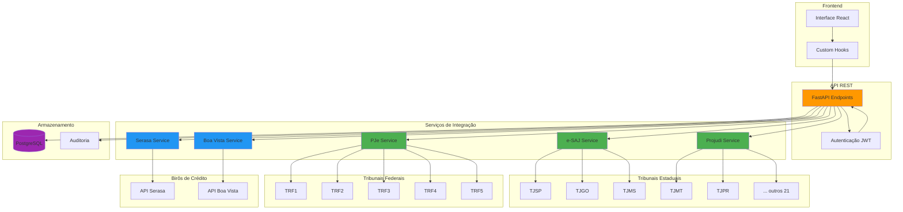
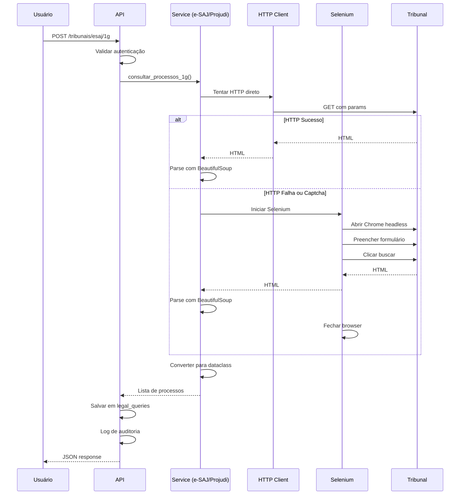
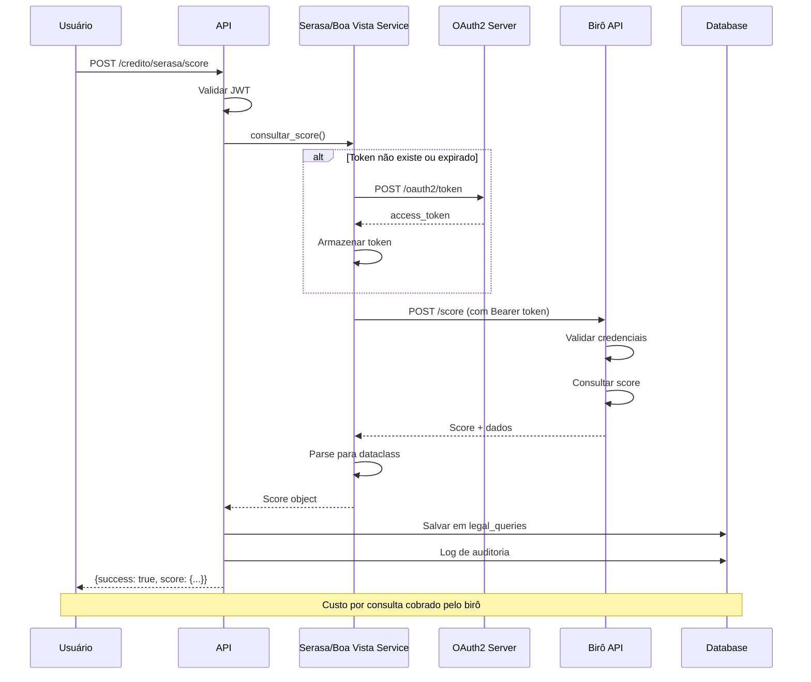
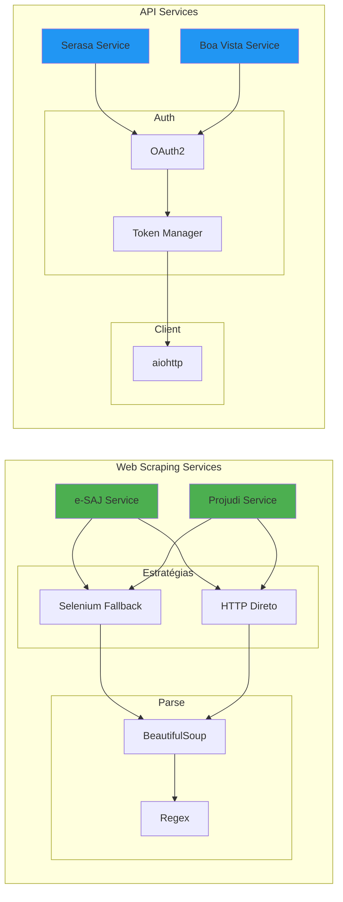
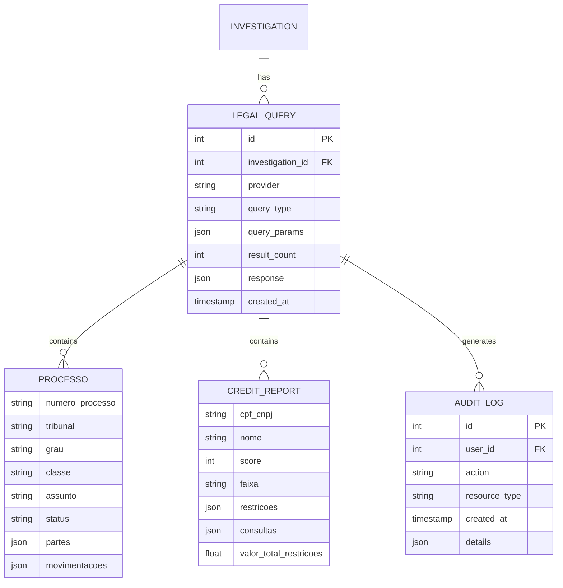
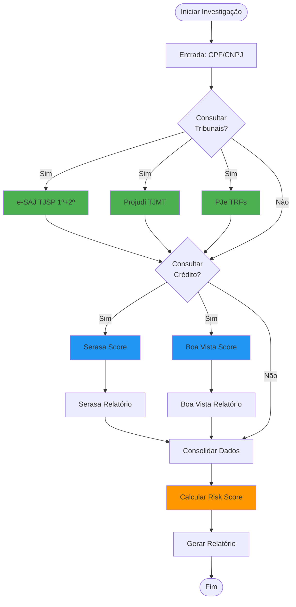
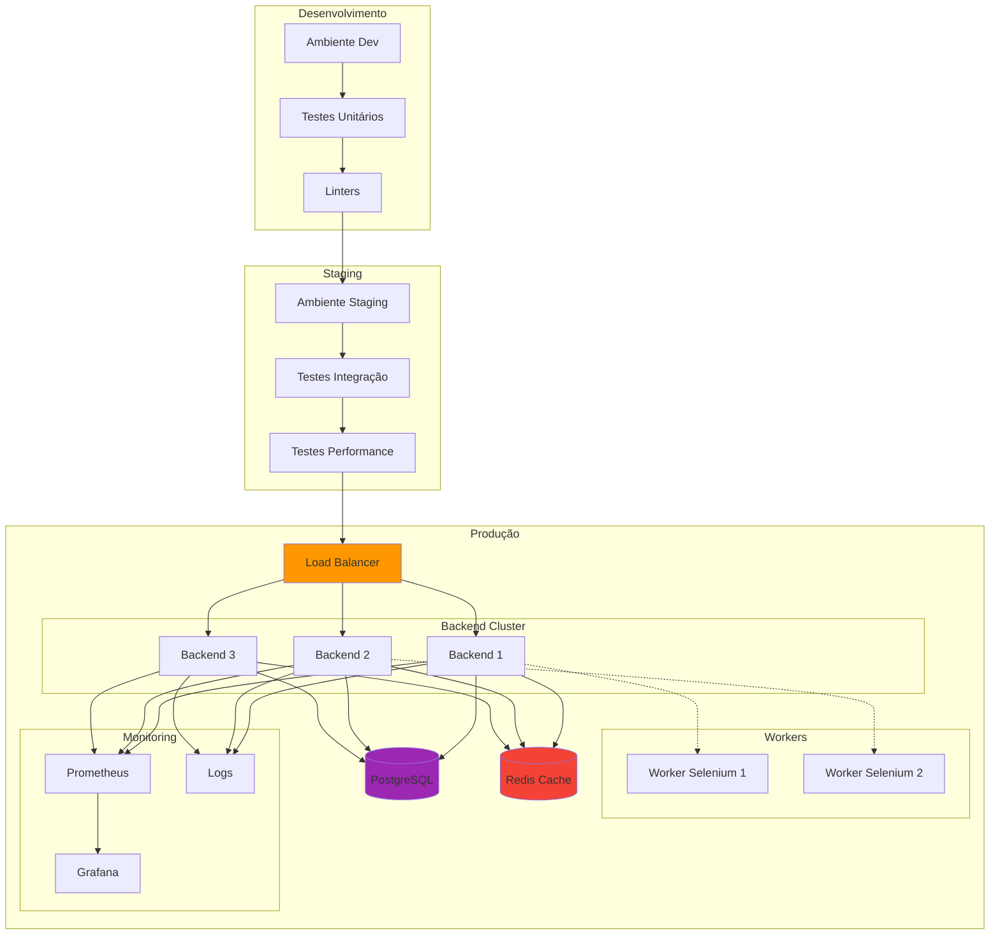
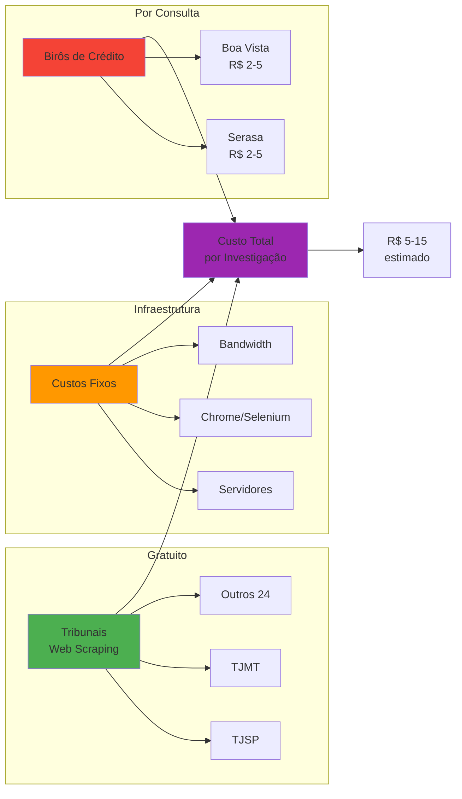
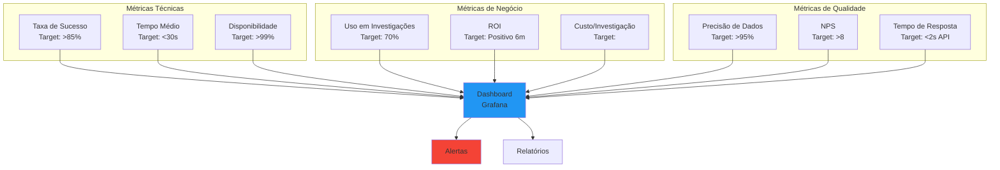
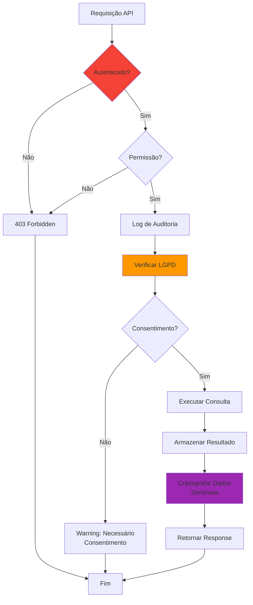

# 🏗️ Arquitetura das Integrações - Diagramas

## 📊 Visão Geral do Sistema

---

## 🔄 Fluxo de Consulta - Tribunais (Web Scraping)

---

## 🔐 Fluxo de Consulta - Birôs de Crédito (OAuth2)

---

## 🏗️ Arquitetura de Serviços

---

## 📊 Modelo de Dados

---

## 🔄 Fluxo de Investigação Completa

---

## 🚀 Deploy e Infraestrutura

---

## 💰 Fluxo de Custos

---

## 📈 Métricas e KPIs

---

## 🔐 Segurança e Compliance

---

**Diagramas criados com Mermaid** - Visualize no GitHub ou em qualquer visualizador Mermaid
