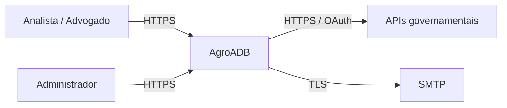
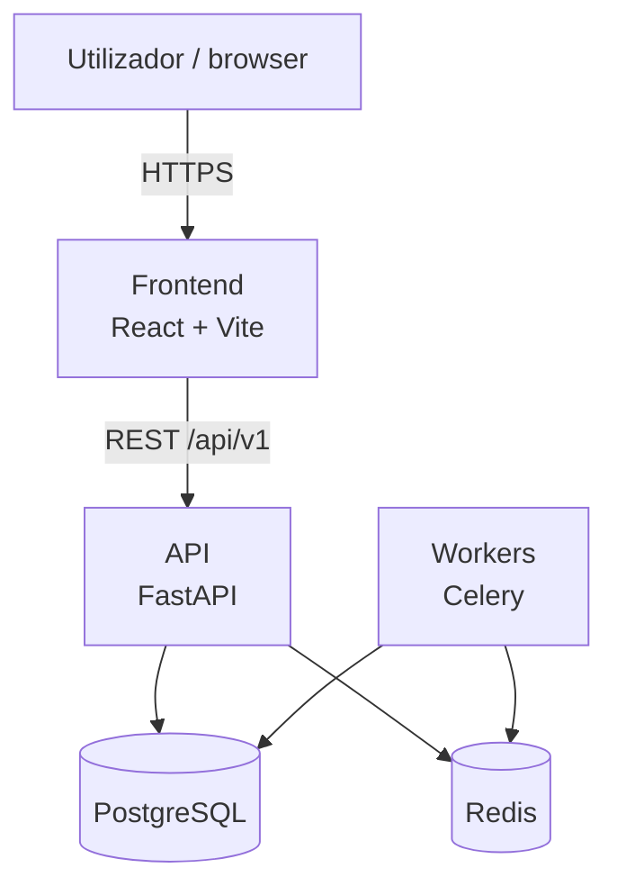
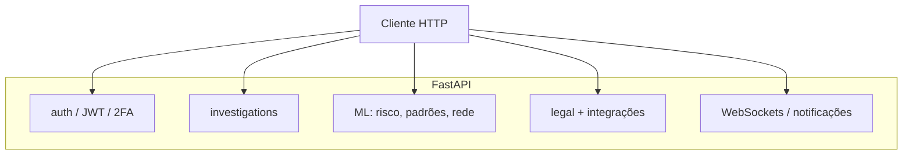

# Diagrama C4 — AgroADB

Visão em camadas conforme [C4 model](https://c4model.com/). Texto em Mermaid (renderiza em GitHub, GitLab, VS Code).

## Nível 1 — Contexto do sistema

## Nível 2 — Contentores

## Nível 3 — Componentes (API)

Para detalhe de classes Python, consulte o código em `backend/app/` e os ADRs em `docs/adr/`.
